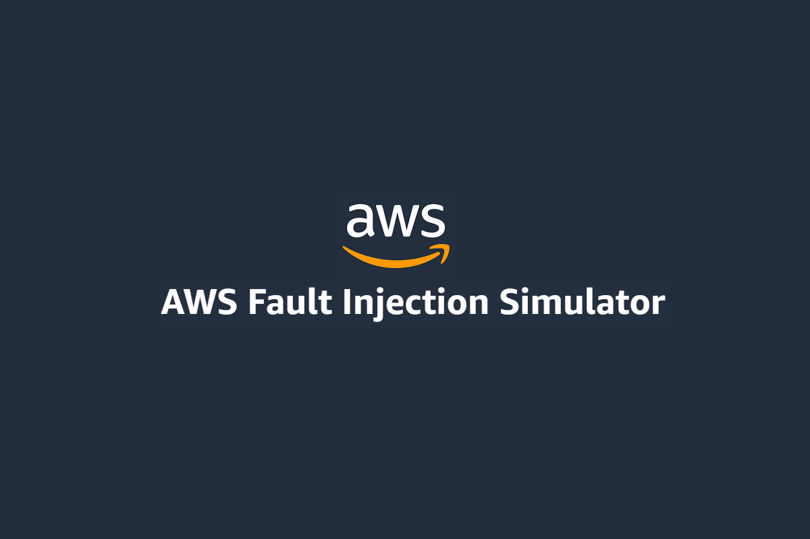
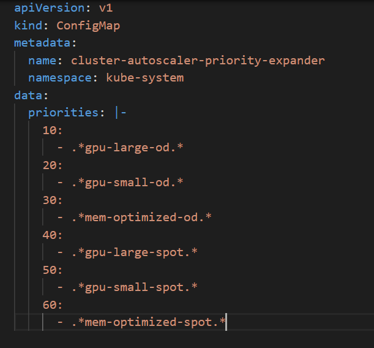
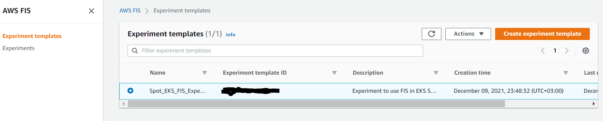
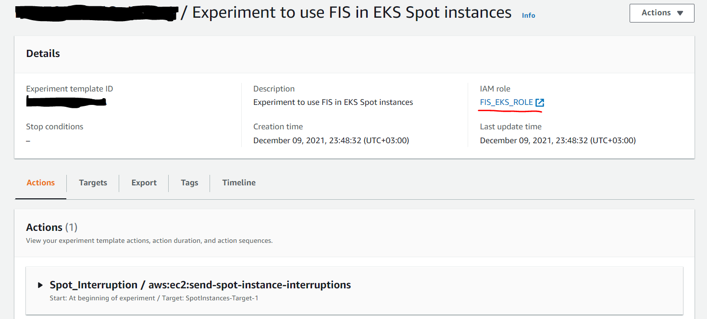
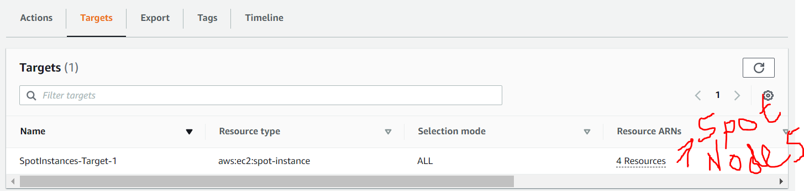
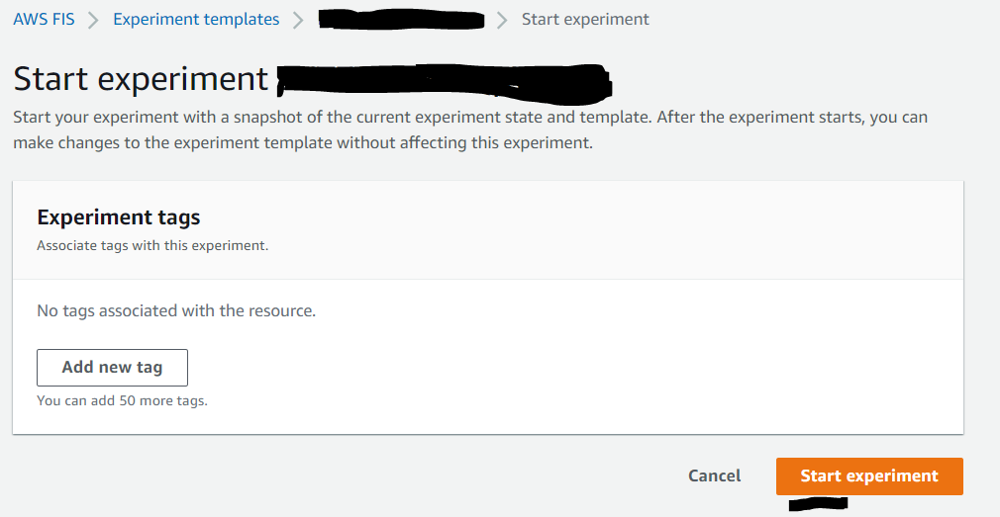
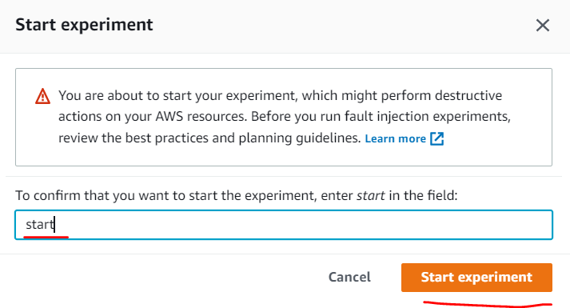
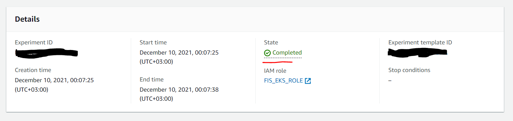
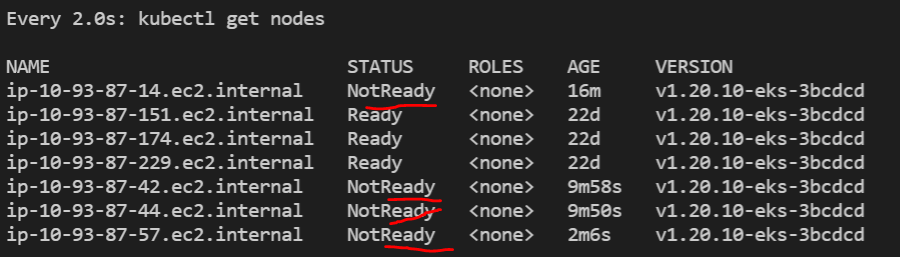

# aws-fault-injection-simulator


#### When we use EKS in AWS and we have a lot of microservices that require a lot of resources (CPU and RAM) we cannot all time use on-demand type of EC2 instances. Especially if you use GPU-type instances which is very expensive. Due to that, we had to choose Spot (the price will be a minimum of 50% less than on-demand)instances by priority. To prefer Spot instance type in AWS we must apply best practices of EKS usage

- [AWS Cluster Autoscaler](https://docs.aws.amazon.com/eks/latest/userguide/autoscaling.html#cluster-autoscaler)
- [Priority based expander for Cluster-Autoscaler](https://github.com/kubernetes/autoscaler/blob/master/cluster-autoscaler/expander/priority/readme.md)
- [AWS Node Termination Handler](https://github.com/aws/aws-node-termination-handler)

#### When computing resources of our Worker nodes will not enough to our POD's, `AWS Cluster Autoscaler` automatically creates a new Worker and join it to EKS master nodes and at the same time when we don't need this worker anymore, it will delete it automatically. When we use multiple node groups with different types of EC2 instances we must group them by the types (For example memory-based high and low, CPU-based high and low, GPU-based high and low). After that, we must tell the cluster autoscaler to please scale nodes by priority(highest number is higher priority) which we defined inside of the configmap of our cluster-autoscaler-expander. For example like as the following


#### `AWS Node Termination handler` (deployed to the cluster like as daemonset) catches the signal from AWS and switches the state of the node to `NoSchedule/NotReady` to not get any new PODs in this node because the Spot instance will be deleted after `120` seconds

#### But when all this stuff is configured and we want to test it to be sure really it works. We cannot wait for AWS when will be deleted `SPOT` type of instance. That is why we will use `AWS Fault Injection Simulator`. It gives us possibility to send signal to our Spot instances and check really our  AWS Node Termination Handler works correctly or not

#### Clone code files which will be used in article

```bash
$ git clone https://github.com/jamalshahverdiev/aws-fault-injection-simulator.git
```

#### Before starting to send signal to the `node termination handler` just be sure inside one of node group you have some spot instances and then execute the following command to create some container inside of this spot instances

```bash 
$ kubectl apply -f deployment.yaml
```

#### Following script by `ASG` name can find pods created in spot instances. The script requires as argument name of the auto-scaling group (Don't forget to change `AWS_PROFILE` variable value)

```bash
$ ./get_pods_spot_instances.sh 'aws_autoscaling_group_name'
```

#### To simulate the environment I have selected one of the ASG's where located some Spot Instances. We will use this ASG's name in the script which will create IAM policies with Role (policies will attached to this role), Experiment template with `Target` (needs instance IDs), and `Action`. We will use `aws:ec2:send-spot-instance-interruptions` action id to send signals to our Spot instances. Execute the following script to do needed steps

```bash
$ ./create_policy_role_fis_template.sh 'aws_autoscaling_group_name'
```

#### After creation in the AWS FIS web interface we can see the template(Open this template and check configurations which applied)




#### Before starting simulate just execute `watch -n1 kubectl get nodes` command to see the node state when aws node termination handler will catch this signal. Click to `Atcions` -> `Start` -> `Start` experiment button



#### The result of simulate execution


#### Kubernetes node states


#### In a parallel inside of some pod we can execute the following command to get 200 responce code result to be pods recreated stable

```bash
$ kubectl exec -it some_of_pod_name_with_curl_installed -n kube-system bash
$ for count in `seq 1000000`; do sleep 0.5; curl -o /dev/null -s -w "%{http_code}\n" http://fischeck.fischeck.svc.cluster.local:8080; done
```

#### If you want to delete all objects which we created just use the following script

```bash
$ ./clean_fis_template_policy_role.sh
```

#### I hope it will be useful to everyone
